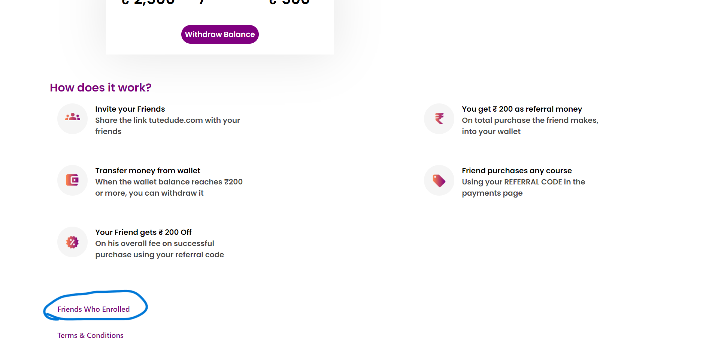
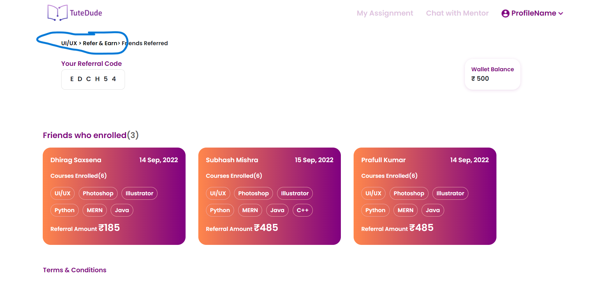

# Summary 
* It is a 2 pages website .
* Used data js to avoid repeating the card data and map all at once which made it dynamic.
* Complete responsive with few animations.
* Used React Router to reduce the load time and go on different page.

# How to go on next page

# Hosted link
https://vansh-baghel.github.io/vansh_tutedude

Thank you!!